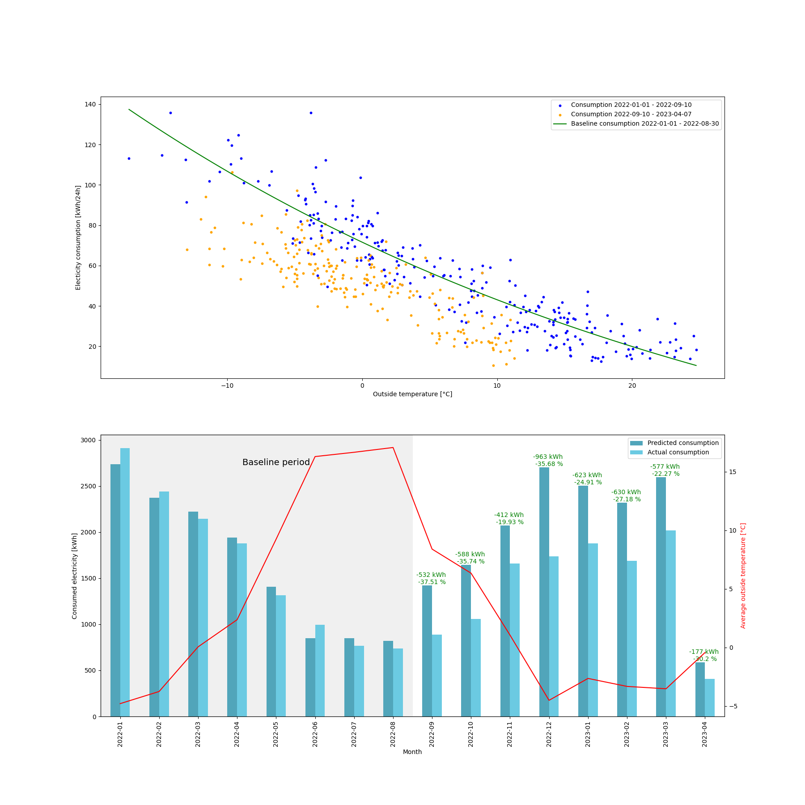

# how-much-electricity-saved
Estimate how much electricity has been saved compared to baseline consumption. The typical electricity consumption as a function of outside temperature is first estimated by fitting a function to the data during a baseline period. The baseline period should extend over a wide range of temperatures. The heat loss of a house has not been modelled in this package. A list of fitting functions are provided that might fit the consumption data or not. An exponential function is used in the example. This will give a too low baseline consumption during summer time, but a reasonably good fit during colder times.

Example output:


## Usage

Create a virtual environment and install dependencies. In Linux or WSL:
```sh
$ python3.9 -m venv .venv
$ source .venv/bin/activate
$ pip install -r requirements.txt 
```

Or in Windows:
```sh
$ python -m venv .venv
$ source .venv/Scripts/activate
$ pip install -r requirements.txt 
```

Install this package
```
$ pip install -e .
```

Install development dependencies as well if you are going to make changes to the code
```
$ pip install -r requirements-development.txt
```

## Running tests

The tests for this project are written with pytest. To run the tests, make sure that the dev dependencies are installed:

```sh
$ pip install -r requirements-development.txt 
```
And then run the tests with the following command:
```sh
$ pytest -v
```

## Example

Run the example in the example folder with the following command:

```sh
$ python3 examples/example.py
``` 

Or in Windows
```sh
$ python examples/example.py
``` 
